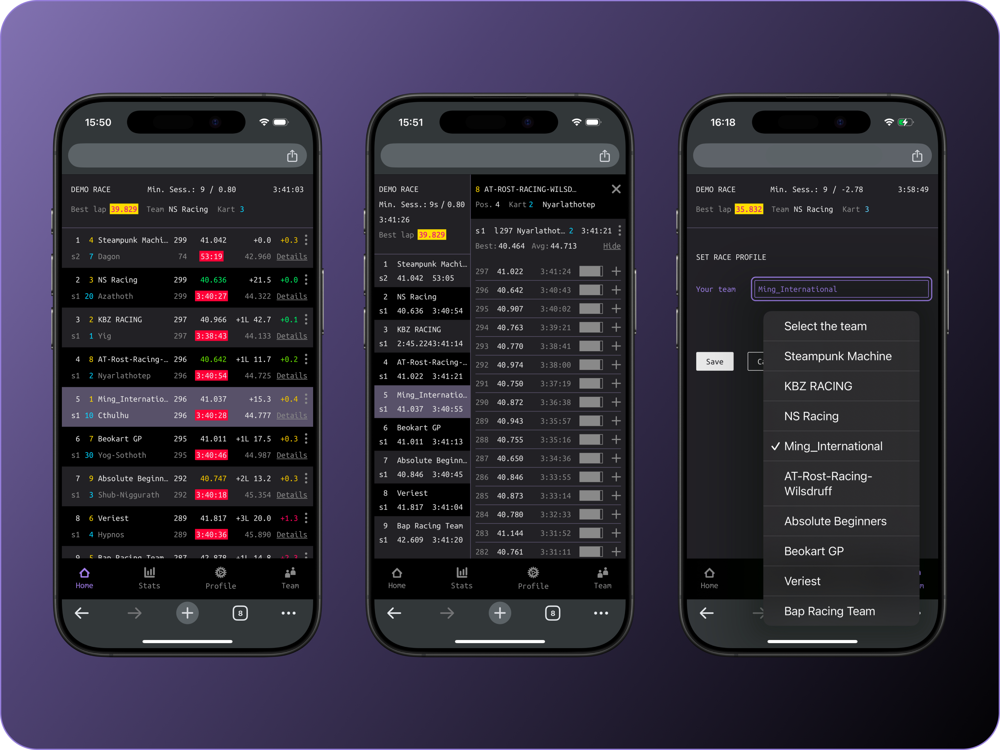
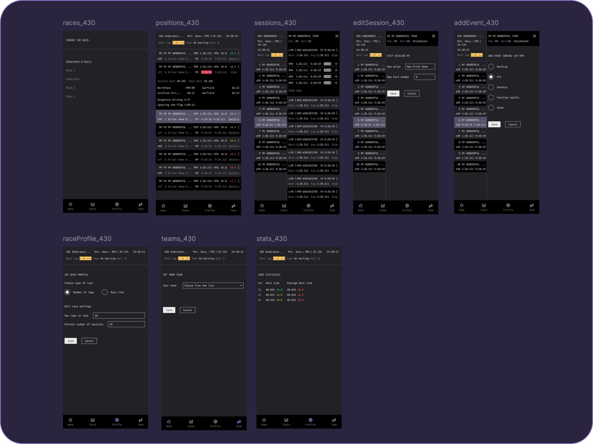
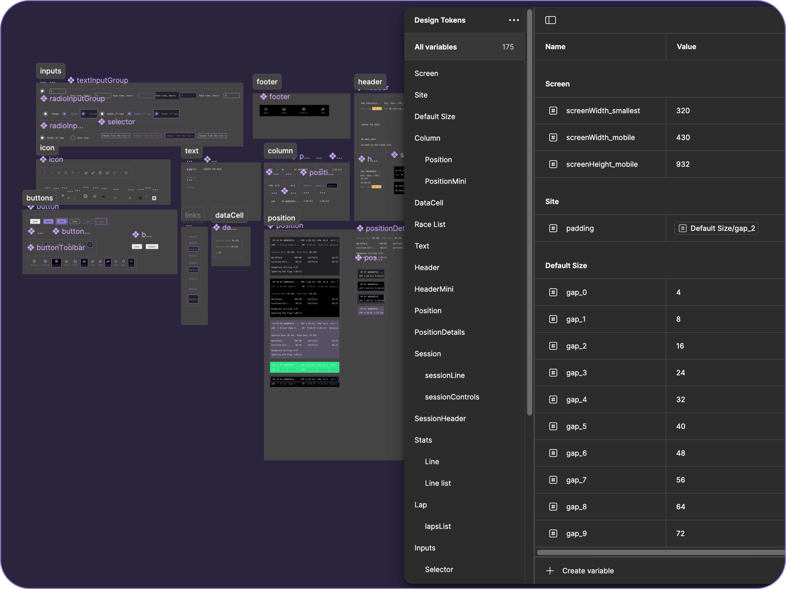
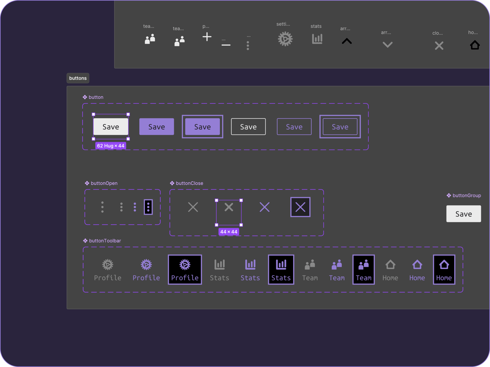

# Race Dashboard

The Race Dashboard app helps in making strategic decisions during a race by providing necessary metrics. Developed and tested by go kart races.

This is a demonstration repository showcasing implementation of the front-end side of the project. The code is isolated and provided for viewing purposes.

At the moment, only the mobile version is available. See the [Figma project](#visual-design) for complete UI/UX design details.



## Expectations from the app:
- **The app should provide as much information as possible at once**
- **The information should be easily scannable and suitable for quick evaluation and comparison**
- **Different pieces of information should be easily distingushable**
- **All visual noise should be reduces as much as possible, cognitive load and distractions should be kept to a minimum**
- **All user tasks should be made with least effort possible**

## Design System & UI/UX Decisions

### User Experience Considerations
- **Navigation**: 
  - All navigation related to the teams' data is implemented via informational elements (like names of the teams), and tap zones are much bigger than corresponding icons; intuitivity is sacrificied for the screen real estate and cleanness; additional navigation is implemented as a bottom toolbar and is design to be easily used with fingers of one hand.
  - The primary app navigation provides step-by-step interaction style: starting with the name of the race the user gradually accesses more and more detailed information until they reach the end where they can add new data via forms; access to all information and actions that are not directly related to teams are isolated to the toolbar; filling out the forms automatically brings the user to the previous screen.
- **Content**: 
  - Information related to the teams and the race is organised in tables that can be easily compared with each other; the main information is always visible on the screens most used during the race; headers display general information about the race and the team that is viewed at the moment.

## Technical Implementation

### Technology Stack
- Typescript 5.2.2
- React 18.2.0
- Redux 9.1.2
- SignalR & Redux middleware for SignalR (redux-signalr) 1.2.0
- React Router for screen navigation, CSS Modules
- Vite 5.2.0

### Project Structure
```
src/
├── app/         # Store, hooks, SignalR Middleware
├── compoenents/ # React components
├── data/        # UI copy and icons
├── features/    # Redux slices
├── styles/      # CSS variables for the design tokens, common styles
├── types/       # Data types
└── utils/       # Helper functions
```

### Key Features
- Real-time race and teams data update.
- Customization of the race parameters. 
- Keeping track of pilots and cars for all teams.
- Calculating parameters needed for the decisions during the race.

## Viewing the Code

This repository is for code review purposes. To explore the codebase, please, browse the source code directly on GitHub.

## Contact

[Your Name]
[Professional Links - GitHub, LinkedIn, etc.]
[How to reach you for questions]

### Visual Design
- **Color Palette**: the dark theme was chosen because it is traditional for such systems and is familiar to the user; also, it contributes to lowering the carbon impact. The pallette incorporates a number of different bright colors to highlight aspects of race data. All colors comply at least with the WCAG 2.2 Level AA.
  - Text and background: light and dark shades of grey are used for text and background; true black is used as an alternative background color for elements differentiation.
  - Main accent colors: shades of purple; a less saturated variant is used for highlighting a team in the list and deviders; a more saturated color is used for controls.
  - Additional accent colors: a number of colors with semantic and/or traditional meaning are used to communicate different signals to the user; they help to draw the attention, distinguish between numbers, show the level of success of teams.


[Screenshot of the app or figma to showcast the colors]

- **Typography**
  - Font faminly: Ubuntu Mono; mono font face was chosen because of large ammount of numbers used and visual organisation of data.
  - Font variety: besides color differentions only text case is used to establish hierarchial order between the elements; the links are traditionally underlined.
  - Sizing: 15px font size is set for all elements because it is the biggest size that adequately fits the layout at the default screen size (mobile); below the default screen size the font size is scaled automatically alongside with other elements; additional font size of 18px is used for inputs to prevent zooming in on input (may be revisited at the next development stage).

- **Component Design**
  - The screens consist of traditional elements;
  - Almost all information is organised in tables; even though there are no lines that form table cells, the pattern forces data in corresponding table cells to remain in strict rows - this is needed for quick scanning and comparison; this pattern is followed in all elements that represent the race data.

### Accessibility Features

Visual implementation doesn't consider a number of accessibility principle due to the specifics of the app and the main requirement to fit as much data as possible on a small screen. That said, the WCAG 2.2 guidance was was followed anywhere it was possible (for example, tap zones). The app will benefit from following the technical accessibility principles like keyboard navigation and screen reader support especially for viewing the results of past races. Currently, this part is under developement.

- **Keyboard Navigation**
  - Under development

- **Screen Reader Optimization**
  - Under development

- **Visual Accessibility**
  - Color contrast ratios meet WCAG 2.2 criteria (minimum Level AA)
  - Text scaling support

## Design Assets

### Figma Project
Complete UI/UX design available on Figma:
- [Figma Project Link](https://www.figma.com/design/wXrteEcg8uDTsmtVstEKRm/Design?node-id=1-2&t=7gwSXWcHseae3ilt-1)

### Key Screens

*Reusable components: the smallest elements and composite elements that are reused across the project*


*Overview of the default screens*


*Screens that show different states of components and variations to the screens*


*Design tokens with several levels of abstractions are used to keep reusable and co-dependent units*


*How design is handeled: underlying structure is implemented in the compoenents; for example, invisible tap zones around the elements that have smaller visual size*


